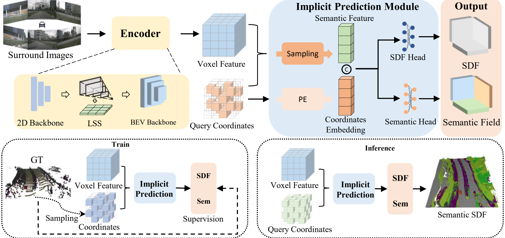

# SurroundSDF: Implicit 3D Scene Understanding Based on Signed Distance Field
The official PyTorch implementation of our **CVPR 2024** paper.
# News
Decision: Accept: Poster (Highlight)

# Abstract
Vision-centric 3D environment understanding is both vital and challenging for autonomous driving systems. Recently, object-free methods have attracted considerable attention. Such methods perceive the world by predicting the semantics of discrete voxel grids but fail to construct continuous and accurate obstacle surfaces. To this end, in this paper, we propose SurroundSDF to implicitly predict the signed distance field (SDF) and semantic field for the continuous perception from surround images. Specifically, we introduce a query-based approach and utilize SDF constrained by the Eikonal formulation to accurately describe the surfaces of obstacles. Furthermore, considering the absence of precise SDF ground truth, we propose a novel weakly supervised paradigm for SDF, referred to as the Sandwich Eikonal formulation, which emphasizes applying correct and dense constraints on both sides of the surface, thereby enhancing the perceptual accuracy of the surface. Experiments suggest that our method achieves SOTA for both occupancy prediction and 3D scene reconstruction tasks on the nuScenes dataset. 
# Overall Pipeline

